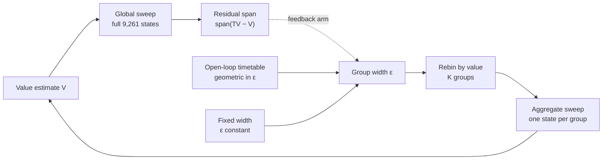
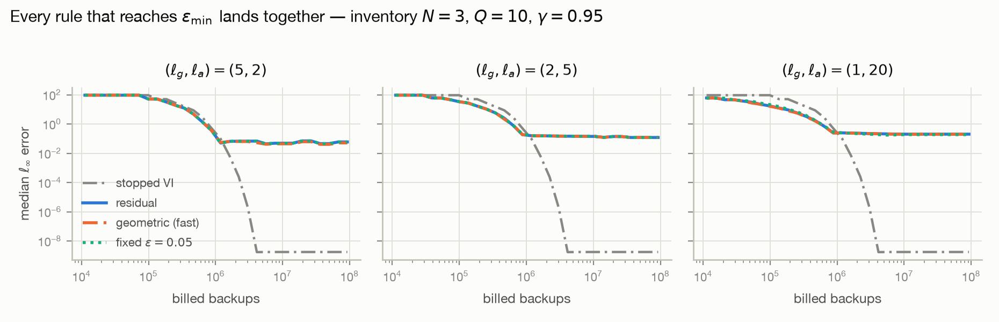

# Residual-Epsilon Aggregation

### Feedback or Annealing? A Controlled Study of Adaptive State Aggregation

This repository accompanies the paper *Feedback or Annealing? A Controlled
Study of Adaptive State Aggregation*. It provides a reproducible study of
whether the Bellman residual, used as a feedback signal for group width, buys
anything over an open-loop schedule that never looks at it — measured on a
9,261-state inventory-control MDP under three update mixes, 20 paired seeds,
and five compute budgets.

**[Read the preprint (PDF)](https://sunnyzhang.dev/feedback_or_annealing.pdf)** —
also available in this repository at
[`paper/feedback_or_annealing.pdf`](paper/feedback_or_annealing.pdf).

## How the comparison works

Adaptive state aggregation alternates cheap updates on groups of similarly
valued states with full-state Bellman sweeps. The group width ε sets the
trade: wide groups are cheaper, narrow groups approximate better. The feedback
rule reads the residual span after each full sweep and narrows ε as the
estimates settle. The controls receive the same width path from a timetable.



Only the box feeding ε changes between arms. The MDP, the seeds, the
alternating schedule, the group cap, and the trace and checkpoint schedule are
identical, so any difference is attributable to the width rule alone.

| | Feedback | Open-loop | Fixed |
|---|---|---|---|
| Width rule | `ε ← max(ε_min, c·span(TV − V))` | `ε_i = max(ε_min, ε₀·(ε_min/ε₀)^(i/(C−1)))` | `ε` constant |
| Reads the residual | Yes, at every aggregate entry | No | No |
| Anneals | Yes | Yes | No |
| Role | Treatment | Matched control | Reference |
| Arm names | `residual` | `geometric_fast`, `geometric_slow`, `geometric_matched` | `fixed_0.05`, `fixed_0.1`, `fixed_0.5` |

The matched control is what the claim rests on. `geometric_matched` re-derives
its starting width, its floor, and its number of cycles to that floor from the
feedback arm's own realized path at each update mix, so the two arms agree by
construction on everything except whether the loop is closed.

## What the runs show

Feedback shows no consistent benefit. Among budget comparisons whose
unadjusted 95% bootstrap intervals exclude zero, its largest advantage is 0.2%
of the comparison error and its largest disadvantage is 5.7%. At 10,000
iterations every interval contains zero and falls inside the preplanned ±0.02
negligible range.

Annealing matters more than the signal driving it. At the `(1, 20)` mix,
annealing reduces error by 22.7% after 10⁵ backups and increases it by 10.4%
after 3×10⁶ — the direction depends on the compute budget.

Both are dominated by a plainer result: full-state value iteration meets its
10⁻¹⁰ stopping tolerance in 4.20M backups, while every 10,000-iteration
aggregation run spends at least 9.2M.

<picture>
  <source media="(prefers-color-scheme: dark)" srcset="results/figures/schedule_inventory_n3_dark.png">
  
</picture>

## Set up the environment

The project requires Python 3.11 or newer. Numba compiles the solver kernels on
first use, so the first run of any experiment is slower than the ones after it.

### macOS or Linux

```bash
git clone https://github.com/sunnysanitize/Residual-Epsilon-Aggregation.git
cd Residual-Epsilon-Aggregation
python3 -m venv .venv
.venv/bin/python -m pip install -e '.[dev,plots]'
```

### Windows PowerShell

```powershell
git clone https://github.com/sunnysanitize/Residual-Epsilon-Aggregation.git
cd Residual-Epsilon-Aggregation
py -m venv .venv
.venv\Scripts\python.exe -m pip install -e ".[dev,plots]"
```

Verify the installation with the validation suite, which lints, type-checks,
and runs the tests in all three execution modes:

```bash
make all
```

## Reproduce the experiments

Each command writes its outputs under `results/`. The scripts solve ground
truth themselves when it is not already cached.

Run the preregistered arm comparison — ground truth, policy baselines, the
fixed-ε reference, and the six frozen arms over 20 seeds:

```bash
scripts/reproduce_residual_epsilon.sh
```

Vary the global/aggregate update mix and index the endpoints by billed backups
rather than wall clock, then plot the result:

```bash
.venv/bin/python scripts/schedule_sweep.py configs/inventory_n3.json
.venv/bin/python scripts/plot_schedule.py results/schedule_inventory_n3.json
```

Re-read the same runs at intermediate compute budgets, where the schedules are
still live, and compare the realized feedback width path against the geometric
reference:

```bash
PYTHONPATH=scripts .venv/bin/python scripts/anytime.py configs/inventory_n3.json
```

Reproduce the maze baselines used to check the implementation against the
published algorithm:

```bash
scripts/reproduce_baseline.sh
```

Wall-clock measurements vary by machine. Final-iterate and backup-indexed
results are deterministic for the configured seeds, and a clean-tree
reproduction reproduces the final iterate of all six arms bit-for-bit.

## Recorded results and reproducibility

The evidence for the figure and for the reanalysis is tracked in the
repository, so a reader can check the reported numbers without first
regenerating 120 solves. Each file records the config it ran, the package
versions and platform it ran on, and the per-seed values behind every summary.

| File | Contents | In the repo |
|---|---|---|
| `results/schedule_inventory_n3.json` | Update-mix sweep over all arms, indexed by billed backups | Tracked |
| `results/anytime_inventory_n3.json` | Budget-indexed reanalysis and the realized width path | Tracked |
| `results/figures/` | The main figure, light and dark | Tracked |
| `results/arms_inventory_n3.json` | The preregistered six-arm comparison, 20 seeds | Regenerated |
| `results/inventory_fixed_eps.json` | Fixed-ε reference at ε ∈ {0.05, 0.1, 0.5} | Regenerated |
| `results/inventory_baselines.json` | Policy baselines and their sanity check against exact `V*` | Regenerated |
| `results/ground_truth/` | Cached exact `V*` per instance, keyed by config hash | Regenerated |

The regenerated files are produced by `scripts/reproduce_residual_epsilon.sh`
and are kept out of version control because they are large and follow
deterministically from the tracked configs. Their contents are recorded in
[docs/metrics.md](docs/metrics.md).

See [docs/residual_epsilon_note.md](docs/residual_epsilon_note.md) for the
frozen parameters, the arms, the endpoint, the null region, and the predictions
recorded before the first residual-arm result, and
[docs/metrics.md](docs/metrics.md) for the measured instance, baseline, and
arm-comparison numbers.

## Repository structure

| Path | Purpose |
|---|---|
| `src/mdpagg/` | MDP models, exact solver, partitioning, backups, and ε policies |
| `configs/` | Frozen experiment configurations for the inventory and maze instances |
| `scripts/` | Sweeps, the budget-indexed reanalysis, audits, and plotting |
| `results/` | Result JSON, figures, and the local ground-truth cache |
| `docs/` | Analysis record and measured metrics |
| `paper/` | Compiled paper |
| `tests/` | Unit, property, and bitwise-reproducibility tests |

## Run the tests

The suite runs in three modes, because a compiled kernel and its pure-Python
equivalent fail in different ways:

```bash
make test     # compiled; the mode every reported number is measured in
make debug    # NUMBA_DISABLE_JIT=1; readable tracebacks
make bounds   # NUMBA_BOUNDSCHECK=1; traps out-of-range reads
```

`make lint` runs Ruff and mypy, and `make all` runs everything in that order.

## Citation

The BibTeX citation will be added when the preprint is publicly hosted.

## License

Released under the [MIT License](LICENSE).
